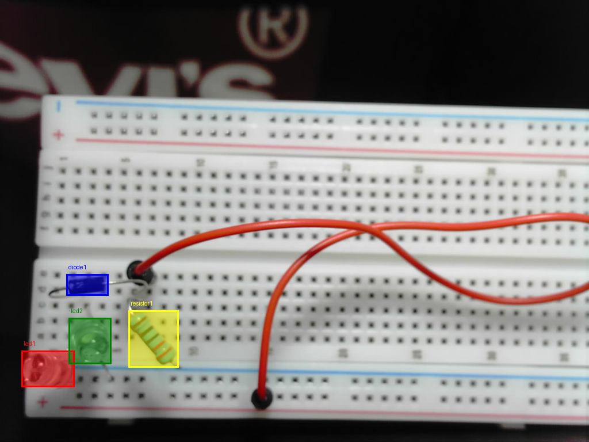
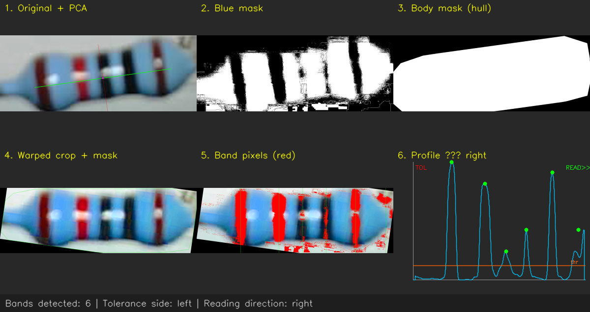
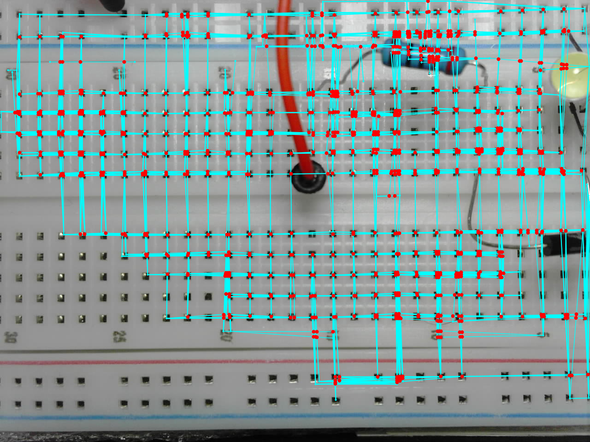

# ElectroTA

An AI-powered electronics lab teaching assistant. Students build circuits on a breadboard while a voice assistant (powered by Gemini Live API) guides them in real time — catching wiring errors, reading probe voltages, and answering questions hands-free.

This code was written for the Gemini Live Agent Hackathon by Eren Menges and Jonathan Thomas.
---

## System Overview

The system has four components:

```
ESP32 Board  ──serial──►  Local Client App  ──WebSocket──►  Server App  ──────►  Gemini APIs
                ◄──────────────────────────────────────────────────────────────
                            audio, interrupts, tool calls
```

### ESP32 Board
- Streams ADC probe voltage readings as text lines (`Probe Voltage: 3.14V`) over serial at 115200 baud.
- Has a capture button that takes a JPEG photo with the onboard ArduCAM and sends it over serial as raw binary.

### Local Client (`local_client.py`)
A "dumb" edge app with no AI logic of its own:
- Accepts a circuit schematic image and an optional serial port as command-line arguments.
- Opens a serial connection to the ESP32 in a background thread, parsing voltage lines and detecting JPEG start/end markers (`FF D8` / `FF D9`) in the byte stream.
- Maintains a rolling 2-second average of probe voltage readings.
- Streams microphone audio (16 kHz PCM) to the server over WebSocket.
- Plays audio received from the server through the speaker.
- When the ESP32 capture button is pressed, the completed JPEG is forwarded to the server automatically.
- When the server requests a probe reading (tool call), returns the rolling average immediately.

### Server (`server.py`)
A FastAPI WebSocket server that orchestrates everything:

**Session startup:**
1. Receives the circuit schematic image from the client.
2. Calls `gemini-3-flash-preview` twice: once for a detailed structured analysis (components, nodes, power rails, current paths, polarity notes, KVL/KCL), then once more to compress that analysis into a compact ASCII summary.
3. Injects the detailed analysis into the Gemini Live system prompt so the assistant knows the target circuit from the start.
4. Opens a `gemini-2.5-flash-native-audio-preview` Live API session and injects the analysis as a conversation briefing turn.

**During conversation:**
- Applies a custom Voice Activity Detection (VAD) algorithm on the server side (Gemini's built-in VAD is disabled). RMS energy thresholds determine speech start/end, with a higher interrupt threshold when Gemini is already speaking.
- Re-injects the compact circuit summary as a silent reminder every 60 seconds to combat context drift.
- Enforces a 20-minute session hard limit and per-IP rate limiting.

**Probe tool call:**
- Gemini is given a `probe()` function declaration. Every time the student says "probe", Gemini issues a tool call.
- The server forwards a `probe_request` to the client, waits up to 10 seconds for the rolling average voltage, then returns the result to Gemini so it can read the voltage aloud.

**Breadboard image analysis:**
- When the client sends a JPEG (from the ESP32 capture button), the server runs the CV pipeline (`breadboard_analysis/complete_analysis.py`) in a thread.
- The CV pipeline result is sent to Gemini as a text turn so the assistant can compare the student's physical wiring against the target circuit.

### CV Pipeline (`breadboard_analysis/`)

| File | Purpose |
|---|---|
| `detect_components.py` | Calls Gemini's segmentation API to locate and crop every resistor, capacitor, and diode in the image. Saves crops and bounding-box JSON to a temporary directory. |
| `get_resistor_analysis.py` | Classical OpenCV: detects color band positions to determine which end of each resistor to start reading from. |
| `resistor_direction_detect.py` | Supporting direction detection for resistor bands. |
| `diode_cathode_detector.py` | Classical OpenCV: finds the cathode stripe on each diode crop. |
| `capacitor_cathode_detection.py` | Classical OpenCV: detects the negative-marking stripe on electrolytic capacitors. |
| `breadboard_detection.py` | Detects breadboard row/column structure and maps component pins to rows. |
| `complete_analysis.py` | Orchestrates all of the above, then sends all crop images and JSON feature files to `gemini-3-flash-preview` (thinking level: medium) for a final spatial analysis of the student's wiring. |

#### Component Segmentation & Analysis

*Gemini-powered component segmentation and labeling.*


*Classical CV pipeline for resistor color band direction detection.*


*Mapping component pins to physical breadboard rows and columns.*

---

## Installation

### Prerequisites
- Python 3.10+
- A Google AI API key (set as `API_KEY` in `.env`)
- An `AUTH_TOKEN` secret shared between client and server (set in `.env`)

### Server

```bash
pip install -r requirements_server.txt
```

The server can also run in Docker:

```bash
docker build -t electro-ta .
docker run -p 8000:8000 --env-file .env electro-ta
```

The server is designed to deploy on Google Cloud Run (see `Dockerfile`). Set `PORT`, `API_KEY`, and `AUTH_TOKEN` as environment variables.

### Local Client

```bash
pip install -r requirements_client.txt
```

**macOS note:** `pyaudio` requires PortAudio. Install it first:

```bash
brew install portaudio
```

### Running

```bash
# On the server machine (or Cloud Run):
python server.py

# On the local machine:
python local_client.py path/to/circuit_schematic.jpg [serial_port]
# Example:
python local_client.py circuit.jpg /dev/cu.usbserial-0001
```

The client will send the schematic to the server, wait for the circuit analysis to complete, then open the live voice session. Type `m` + Enter at any time to mute/unmute the microphone.

### ESP32 Flashing

The firmware lives in `ESP32_Firmware/` and is a PlatformIO project.

1. Install [PlatformIO](https://platformio.org/).
2. Open `ESP32_Firmware/` in VS Code with the PlatformIO extension (or use the CLI).
3. Connect the ESP32 over USB and run:

```bash
cd ESP32_Firmware
pio run --target upload
```

The firmware expects an ArduCAM module connected over SPI. On boot it streams `Probe Voltage: X.XXV` lines continuously over serial at 115200 baud, and sends a JPEG over serial when the capture button is pressed.

---

## Environment Variables

Create a `.env` file at the project root:

```
API_KEY=your_google_ai_api_key
AUTH_TOKEN=a_secret_token_shared_between_client_and_server
SERVER_URL=ws://localhost:8000/ws   # override for remote server
```
